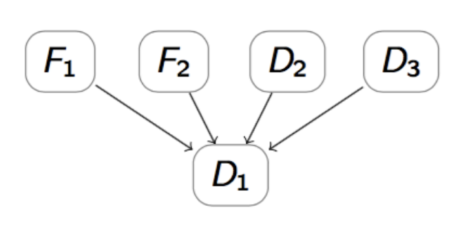

# Lesson 10 - Temporal modeling

## Multimorbilidade

O desafio está em lidar com as doenças e a sua interação:
- Muitas doenças distintas e classes de doenças
- Interações incertas entre doenças
- Diferenças de prevalência incertas entre regiões, sociais e sexo

Lappenschaar et al (2013)

### Multimorbilidade - Modelo Causal

ERRADO, modelo diagnóstico:

CERTO, modelo causal:

- O modelo diagnóstico representado por uma análise de regressão de D1 assume que todas as variáveis restantes são independentes entre si e certas, em oposição ao modelo causal em que todas os verdadeiras (e possíveis) dependências são modeladas
- Os modelos gráficos probabilísticos, tais como as redes Bayesianas, permitem um modelo explícito através de um grafo (descoberto por aprendizagem da estrutura)

Peter Lucas (2014)

### Tipos de Multimorbilidade

- Doenças incondicionalmente independentes: ou seja, doenças distintas que co-ocorrem simultaneamente.
  - \( P(D_i, D_j) = P(D_i) P(D_j) \)
  - Sem sinais ou sintomas comuns
  - Com sinais ou sintomas comuns

- Doenças dependentes, condicionalmente independentes: têm uma causa comum.
  - \( P(D_i, D_j | F) = P(D_i | F) P(D_j | F) \)
  - Regressão logística: \( \beta_{ij} = 0 \)
  - Aprendizagem estrutural: \( D_i \leftarrow F \rightarrow D_j \)

- Doenças dependentes, com dependência direta.
  - \( P(D_i, D_j) \neq P(D_i) P(D_j) \)
  - Regressão logística: \( \beta_{ij} \neq 0 \)
  - Aprendizagem estrutural: \( F \rightarrow D_i \rightarrow D_j \)

### Modelação Bayesiana na multimorbilidade

- Na regressão logística, doenças são frequentemente utilizadas como...
  - variável de resultado num modelo (A)
  - variável explicativa noutro modelo (B)
  - ⇒ múltiplos modelos

- Uso de termos de interação:
  - \(\beta_{ij} = 0 \rightarrow\) Independência Verdadeira ou Confusão?
  - \(\beta_{ij} \neq 0 \rightarrow\) Dependência Condicional ou Causalidade?

- Nas Redes Bayesianas, todas as variáveis são tratadas como incertas:
  - um modelo, com (possível) representação de processos subjacentes
  - interações automaticamente incorporadas
  - permite distinguir entre várias formas de multimorbilidade

Na regressão logística, as variáveis podem ser usadas de diferentes formas em diferentes modelos, criando a necessidade de múltiplos modelos para capturar todas as relações. Termos de interação (\(\beta_{ij}\)) são utilizados para verificar se existe independência verdadeira (\(\beta_{ij} = 0\)) ou dependência condicional (\(\beta_{ij} \neq 0\)) entre variáveis.

As Redes Bayesianas oferecem uma abordagem unificada onde todas as variáveis são tratadas como incertas. Isso permite a representação de processos subjacentes e a incorporação automática de interações entre variáveis. Esta abordagem facilita a distinção entre várias formas de multimorbilidade, oferecendo uma visão mais integrada e compreensiva das relações entre as variáveis em estudo.

## Interações Temporais

- Uma vez que neste tipo de problemas:
  - Há co-existência temporariamente dependente de fatores de risco
  - Os doentes são suscetíveis a expressar múltiplas comorbilidades
  - E a desenvolver novas doenças...
  - precisamos de novos desenhos de estudo com componentes analíticos temporais.

Mas a representação de eventos temporais, e a sua interpolação, depende em grande medida da abstração temporal escolhida para a modelação.

## Probabilidades de Transição

- Probabilidade de ocorrer de um estado de saúde para outro (state-transition model)
- Probabilidade de experienciar um evento (discrete-event simulations)
- As probabilidades (de transição) são o motor de um modelo de decisão. Muitas vezes são derivados da literatura.

Tipos de inputs tipicamente encontrados na literatura: probabilidades (risco), taxas (mortalidade), risco relativo, odds ratio, hazard ratio...
  - Mas nós precisamos de dados sobre a forma de probabilidades para poder utilizá-las no modelo!!!

- É necessário transformar as probabilidades disponíveis na literatura de forma a que se enquadrem na janela temporal adequada para o nosso modelo.
- As taxas podem ser manipuladas matematicamente (somadas, divididas, etc) -> as probabilidades não!! Daí que o que se faz é o seguinte: Probabilidade -> Taxa -> Probabilidade.

Nota: isto assume que o evento ocorre a uma taxa constante num dado período de tempo.

- **Probabilidade -> Taxa**:
  - Taxa = - ln(1 - p) / t

- **Taxa -> Probabilidade**:
  - Probabilidade = 1 - exp(-r*t)
  - p = probabilidade; t = tempo; r = taxa

- **RR -> Probabilidade**:
  - Aqui é preciso ter cuidado porque se o RR é resultado de uma regressão, este terá sido ajustado para os covariantes, enquanto que a odds ratio não ajustada...
  - Probabilidade expostos = RR x probabilidade dos não expostos.

- **OR -> Probabilidade**:
  - É mais comum encontrar OR do que RR na literatura.
  - Se o outcome for raro (<10%), então pode assumir-se o OR como uma aproximação do RR.

## Dados de Sobrevivência e Probabilidades

- Todos as probabilidades prévias assumiram-se constantes ao longo do tempo.
- No entanto NÃO se deve assumir isto.
  - Assim, fará sentido ter várias probabilidades para o evento no modelo - uma para cada período de tempo de interesse.

- **Curva de Kaplan-Meier**
  - Não ajustado -> utilizar com dados de RCT.
- **Curva de Modelo de Riscos Proporcionais de Cox**
  - Ajustado -> utilizar com dados observacionais.
